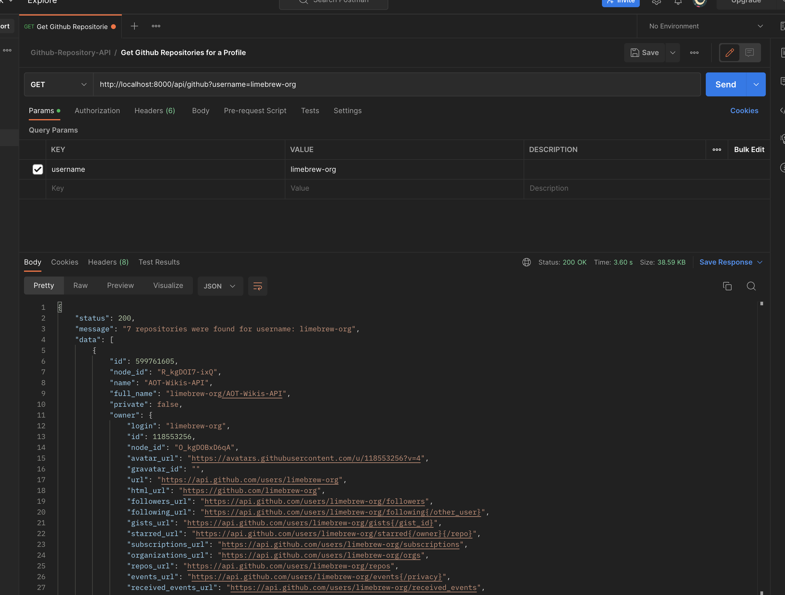
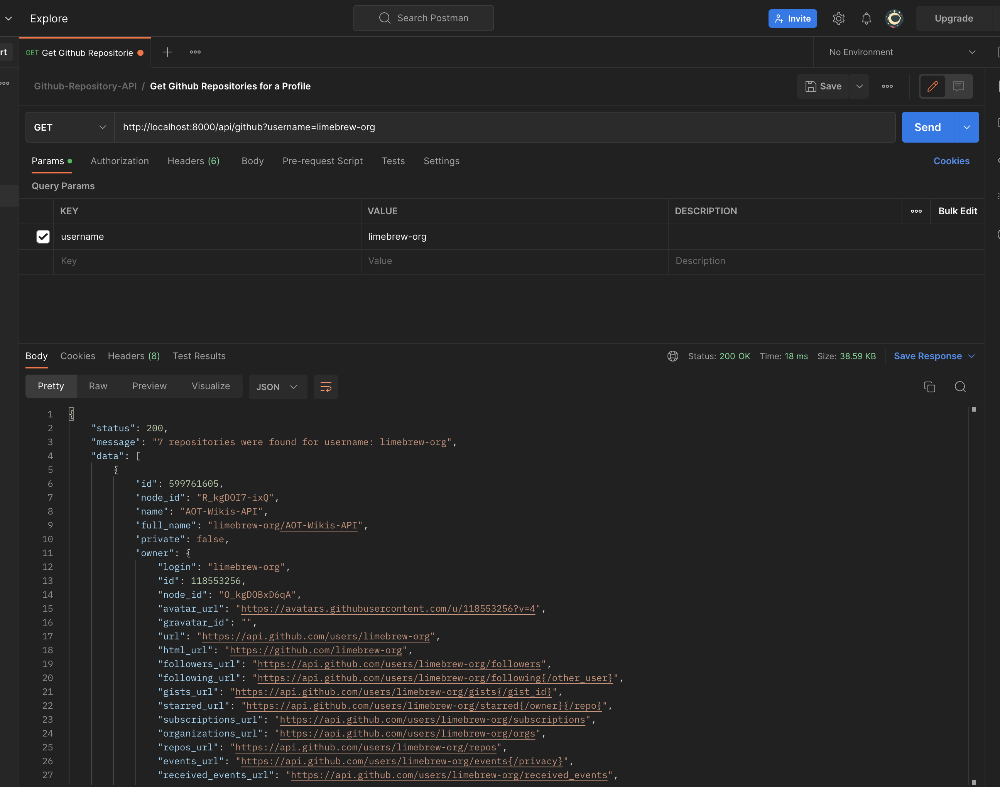

# Cache-Policy-Testing
Testing Caching using Redis and Express by Caching Github Repository API

## Setup and Install
To setup this repository, clone it using:

        git clone git@github.com:limebrew-org/cache-policy-testing.git

Install the dependencies using `npm`

        npm install

## Run Using Docker and Docker Compose

To run the application in development mode:

        docker-compose -f docker-compose.dev.yml up -d --build

To run the application in production mode:

        docker-compose -f docker-compose.prod.yml up -d --build

To stop the application:

        docker-compose -f docker-compose.dev.yml down

or 

        docker-compose -f docker-compose.prod.yml down

## Endpoints:

The application uses Github Repository API to fetch repositories by valid github usernames.
This can be provided by passing `username` via Request Query parameters (`?username=`)

        
        GET http://localhost:8000/api/github?username=limebrew-org

### Cache Miss
In Case of Cache Miss, it will call the API directly and set the cache with values (username,value), which you can see in the response time for the request below:

### Cache Hit
In Case of Cache Hit, then value for the key (username) is fetched and sent as a response to the client which is visible in the response time for the request  below:

### Cache Expiration
The cache is being expired automatically when the `CACHE_EXPIRATION_TIME` is reached which is passed from `.env` files set to `120` seconds. After that, the key will be removed and for next request, a brand new API call will be done.